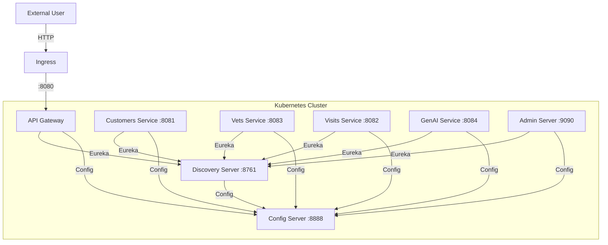

# Design Document: Kubernetes Helm Deployment for Spring PetClinic

## Overview

This design provides a Helm chart for deploying the Spring PetClinic microservices to Kubernetes. The chart reuses the existing shared Dockerfile pattern (Spring Boot layer extraction on Eclipse Temurin 17) and translates the docker-compose orchestration into Kubernetes-native constructs: Deployments, Services, ConfigMaps, Secrets, init containers for startup ordering, and an optional Ingress for external access.

## Architecture



### Startup Order

Mimicking the docker-compose `depends_on` with `service_healthy`:

1. Config Server starts first (no dependencies)
2. Discovery Server waits for Config Server health check
3. All other services wait for both Config Server and Discovery Server

This is achieved via Kubernetes init containers that poll health endpoints.

## Components and Interfaces

### Helm Chart Structure

```
helm/petclinic/
├── Chart.yaml
├── values.yaml
├── templates/
│   ├── _helpers.tpl
│   ├── config-server/
│   │   ├── deployment.yaml
│   │   └── service.yaml
│   ├── discovery-server/
│   │   ├── deployment.yaml
│   │   └── service.yaml
│   ├── api-gateway/
│   │   ├── deployment.yaml
│   │   ├── service.yaml
│   │   └── ingress.yaml
│   ├── customers-service/
│   │   ├── deployment.yaml
│   │   └── service.yaml
│   ├── vets-service/
│   │   ├── deployment.yaml
│   │   └── service.yaml
│   ├── visits-service/
│   │   ├── deployment.yaml
│   │   └── service.yaml
│   ├── genai-service/
│   │   ├── deployment.yaml
│   │   ├── service.yaml
│   │   └── secret.yaml
│   └── admin-server/
│       ├── deployment.yaml
│       └── service.yaml
```

### Service Configuration Table

| Service | Port | Health Endpoint | Dependencies |
|---------|------|-----------------|--------------|
| Config Server | 8888 | /actuator/health | None |
| Discovery Server | 8761 | /actuator/health | Config Server |
| API Gateway | 8080 | /actuator/health | Config Server, Discovery Server |
| Customers Service | 8081 | /actuator/health | Config Server, Discovery Server |
| Vets Service | 8083 | /actuator/health | Config Server, Discovery Server |
| Visits Service | 8082 | /actuator/health | Config Server, Discovery Server |
| GenAI Service | 8084 | /actuator/health | Config Server, Discovery Server |
| Admin Server | 9090 | /actuator/health | Config Server, Discovery Server |

### Init Container Pattern

Each service that depends on Config Server/Discovery Server uses a busybox init container:

```yaml
initContainers:
  - name: wait-for-config-server
    image: busybox:1.36
    command: ['sh', '-c', 'until wget -qO- http://config-server:8888/actuator/health | grep UP; do sleep 2; done']
  - name: wait-for-discovery-server
    image: busybox:1.36
    command: ['sh', '-c', 'until wget -qO- http://discovery-server:8761/actuator/health | grep UP; do sleep 2; done']
```

### Docker Image Strategy

The existing shared `docker/Dockerfile` already handles all services via build args (`ARTIFACT_NAME`, `EXPOSED_PORT`). Each service produces its own image named `{repository}/{service-name}:{tag}`. The Helm chart references these images via `values.yaml`.

## Data Models

### values.yaml Schema

```yaml
global:
  imageRegistry: "springcommunity"
  imageTag: "latest"
  imagePullPolicy: IfNotPresent

configServer:
  replicaCount: 1
  image:
    repository: ""  # defaults to global.imageRegistry/spring-petclinic-config-server
    tag: ""         # defaults to global.imageTag
  port: 8888
  git:
    uri: "https://github.com/spring-petclinic/spring-petclinic-microservices-config"
    branch: "main"
  resources:
    requests:
      memory: "256Mi"
      cpu: "200m"
    limits:
      memory: "512Mi"
      cpu: "500m"

discoveryServer:
  replicaCount: 1
  port: 8761
  resources:
    requests:
      memory: "256Mi"
      cpu: "200m"
    limits:
      memory: "512Mi"
      cpu: "500m"

apiGateway:
  replicaCount: 1
  port: 8080
  service:
    type: ClusterIP  # or LoadBalancer / NodePort
    nodePort: ""
  resources:
    requests:
      memory: "256Mi"
      cpu: "200m"
    limits:
      memory: "512Mi"
      cpu: "500m"

customersService:
  replicaCount: 1
  port: 8081
  resources:
    requests:
      memory: "256Mi"
      cpu: "200m"
    limits:
      memory: "512Mi"
      cpu: "500m"

vetsService:
  replicaCount: 1
  port: 8083
  resources:
    requests:
      memory: "256Mi"
      cpu: "200m"
    limits:
      memory: "512Mi"
      cpu: "500m"

visitsService:
  replicaCount: 1
  port: 8082
  resources:
    requests:
      memory: "256Mi"
      cpu: "200m"
    limits:
      memory: "512Mi"
      cpu: "500m"

genaiService:
  replicaCount: 1
  port: 8084
  openaiApiKey: ""
  azureOpenaiKey: ""
  azureOpenaiEndpoint: ""
  resources:
    requests:
      memory: "256Mi"
      cpu: "200m"
    limits:
      memory: "512Mi"
      cpu: "500m"

adminServer:
  replicaCount: 1
  port: 9090
  resources:
    requests:
      memory: "256Mi"
      cpu: "200m"
    limits:
      memory: "512Mi"
      cpu: "500m"

ingress:
  enabled: false
  className: ""
  host: "petclinic.local"
  annotations: {}

mysql:
  enabled: false
  host: ""
  port: 3306
  database: "petclinic"
  username: "petclinic"
  password: ""
```

## Correctness Properties

*A property is a characteristic or behavior that should hold true across all valid executions of a system-essentially, a formal statement about what the system should do. 
Properties serve as the bridge between human-readable specifications and machine-verifiable correctness guarantees.*

Property Reflection:
- 2.3 (values override) and 6.2 (resource override) are the same property — any custom value should appear in rendered output. Consolidate into one "values override" property.
- 3.3 (init containers for downstream) and 3.4 (liveness probes) are distinct properties across all services.
- 4.2 (ingress host) and 5.1 (config git URI) both test "custom value appears in rendered output" — these are subsumed by the general values override property.
- 6.1 (default resources) is a specific instance of "default values render correctly" which is distinct from override testing.

After reflection, the unique testable properties are:

### Property 1: Helm template renders without errors for valid values

*For any* valid values.yaml configuration (varying replica counts, image tags, resource limits, enabled/disabled features), running `helm template` SHALL produce output with zero exit code.

**Validates: Requirements 2.2**

### Property 2: Values override propagation

*For any* service and *for any* overridden value (image repository, image tag, replica count, resource requests, resource limits), the rendered Kubernetes manifest SHALL contain the overridden value in the corresponding field.

**Validates: Requirements 2.3, 6.2**

### Property 3: Correct target ports on all Services

*For any* rendered chart output with default or custom values, each Kubernetes Service SHALL have a `targetPort` matching the documented port for that microservice (Config: 8888, Discovery: 8761, Gateway: 8080, Customers: 8081, Vets: 8083, Visits: 8082, GenAI: 8084, Admin: 9090).

**Validates: Requirements 2.4**

### Property 4: Downstream services have init containers for dependencies

*For any* downstream service (API Gateway, Customers, Vets, Visits, GenAI, Admin), the rendered Deployment SHALL contain init containers that wait for both Config Server and Discovery Server health endpoints.

**Validates: Requirements 3.3**

### Property 5: All deployments have liveness and readiness probes

*For any* service deployment rendered by the chart, the pod spec SHALL include both a `livenessProbe` and a `readinessProbe` targeting the `/actuator/health` endpoint on the service's port.

**Validates: Requirements 3.4, 3.1**

### Property 6: Default resource limits

*For any* service rendered with default values, the pod spec SHALL have `resources.limits.memory` set to `512Mi`.

**Validates: Requirements 6.1**

### Property 7: Ingress host propagation

*For any* host string provided via `ingress.host` with `ingress.enabled=true`, the rendered Ingress resource SHALL contain that host in its rules.

**Validates: Requirements 4.2**

## Error Handling

- If Config Server is unavailable, init containers will retry indefinitely (Kubernetes will eventually timeout the pod based on `activeDeadlineSeconds` if configured).
- Services use Spring Cloud Config's `fail-fast: true` with retry to handle transient config server unavailability after startup.
- Liveness probes restart containers that become unresponsive. Readiness probes remove unhealthy pods from Service endpoints.
- The GenAI service gracefully degrades if no OpenAI API key is provided (the service starts but the chatbot feature is unavailable).

## Testing Strategy

### Helm Chart Validation

- Use `helm lint` to validate chart structure
- Use `helm template` to render manifests and validate YAML structure
- Use `helm unittest` (helm-unittest plugin) for property-based and unit testing of templates

### Property-Based Testing

Library: **helm-unittest** (https://github.com/helm-unittest/helm-unittest)

Each correctness property will be implemented as a helm-unittest test that validates rendered templates against assertions. The tests will iterate across all services to verify universal properties.

- Each property-based test will be annotated with a comment referencing the design document property: `# Feature: k8s-helm-deployment, Property {number}: {property_text}`
- Tests run against the chart templates without requiring a live cluster
- Each correctness property maps to a single test file

### Unit Tests

- Specific example tests for: secret creation when API key is provided, ingress creation when enabled, LoadBalancer type when configured
- Edge cases: empty values, missing optional fields

### Integration Testing (Manual)

- Deploy to a local cluster (minikube/kind) and verify all pods reach Running state
- Validate end-to-end connectivity from Ingress to API Gateway to backend services

